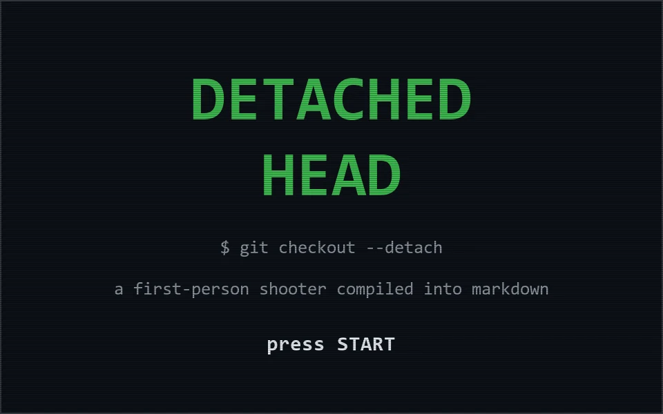
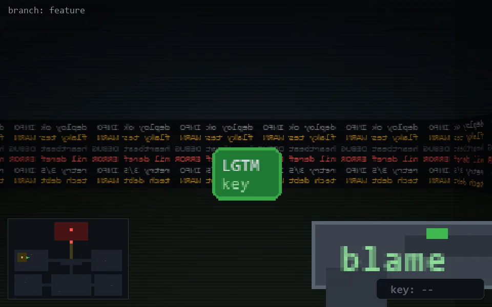
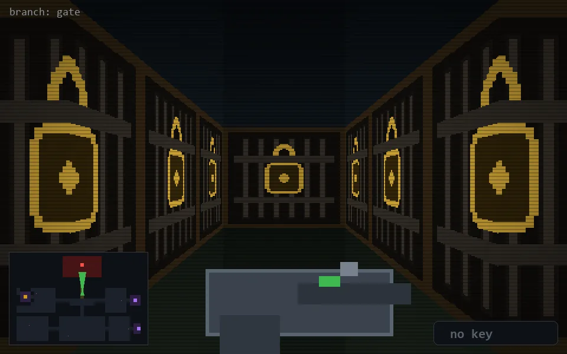
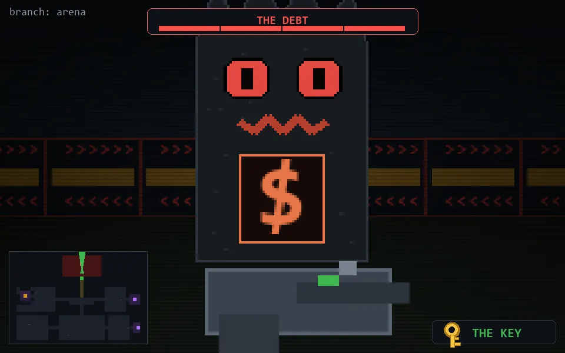
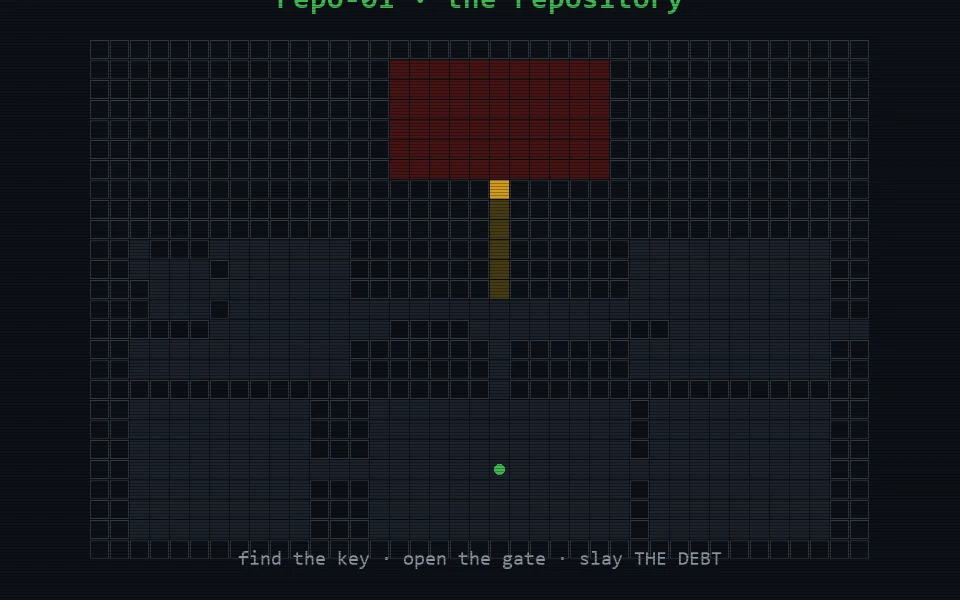

<!-- DETACHED HEAD -->
<p align="center"></p>

<p align="center">
<a href="game/x20y21N.md"></a>
&nbsp;<a href="LEADERBOARD.md"></a>
</p>

---

You fell asleep at your desk and woke up **inside a repository** — a dungeon
made of code, frozen creatures and half-remembered decisions. Somewhere in
the dark wing a **golden key** is still warm. It opens **the gate** — and
behind the gate waits **THE DEBT**: the ancient thing that has been growing
in the dark since 2009, grinning, with a burning `$` in its chest.

Find the key. Open the gate. Slay THE DEBT. Then you can go home.

*(Devs: yes, the wings are branches, the walls are logs and merge conflicts,
and the gun says `blame` on the barrel. That layer is yours. Everyone else
gets a dungeon, a key, a gate and a monster.)*

<p align="center"></p>
<p align="center"></p>

## How to play

Every screen is one markdown file. One click = one move.

| click | move | | click | move |
|---|---|---|---|---|
| ⬆️ | step forward | | ⬅️ / ➡️ | turn left / right |
| ⬇️ | step back | | 💥 | fire |

🔑 The key picks itself up when you walk into it.
🚫 ⛔️ means a wall (or a locked gate).
⚔ THE DEBT grows back if you flee the arena and return.

**This is turn-based by nature.** Every click is a page load on github.com —
the repository chrome blinks, then your new frame arrives. That is not a bug
to fix, it is the medium's metronome: play it like chess with a raycaster,
not like Quake. (There is also no sound. The repo is very quiet.)

## The map

<p align="center"></p>

## How this works (no, there is no engine)

- The whole game is **4233 markdown files** hyperlinked into a stateless graph: one file per (position × facing × world state).
- Walls are **missing links**. The boss has health because its HP lives only inside the arena sub-graph — that trick is why this game can do things a "Doom in a README" cannot.
- Frames are raycast-rendered by a ~100%-numpy Wolfenstein-style renderer, with procedurally generated textures, sprites, HUD and minimap. Zero external assets.
- Speedruns: open an issue `/run FFRRX...` and a GitHub Action replays your route over `data/graph.json`. See [LEADERBOARD.md](LEADERBOARD.md).

Design math and pipeline internals: [docs/DESIGN.md](docs/DESIGN.md) ·
speedrun guide: [docs/LEADERBOARD.md](docs/LEADERBOARD.md)

## Rebuild from source

```
python build.py            # regenerates every frame and the whole graph
pytest                     # graph invariants
```

MIT License. Everything in this repo — code, textures, sprites, the level —
is generated by this repo.
