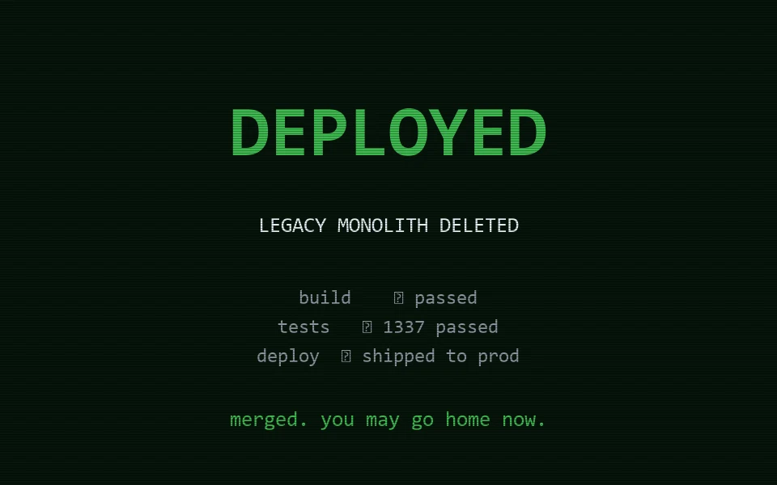

<!-- node:WIN -->
### `branch: prod` · the way out · all checks passed

# ✔ YOU ESCAPED

**THE DEBT** is deleted. The build is green, the tests pass, the way home is
open. You may go home now.

🏆 Think you can escape faster? Submit a speedrun:
open an issue titled `/run FFRRRF...` with your route — see
[LEADERBOARD.md](../LEADERBOARD.md).

[⌂ index](../README.md)
