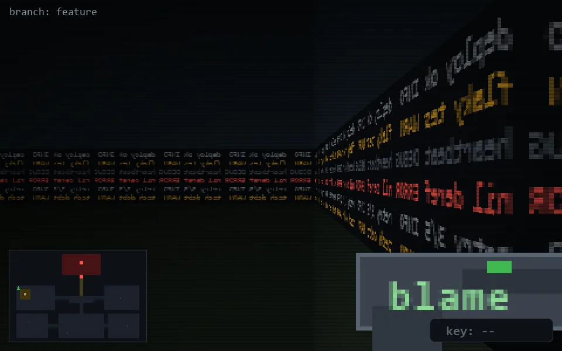

<!-- node:x02y10S -->
### `branch: feature` · 📍 (2, 10) · facing S · 🔑 —

|      |      |      |
|:----:|:----:|:----:|
|      | [⬆️](x02y11S.md) |      |
| [⬅️](x02y10E.md) | [💥](x02y10S.md) | [➡️](x02y10W.md) |
|      | ⛔️ |      |

[⌂ index](../README.md)
