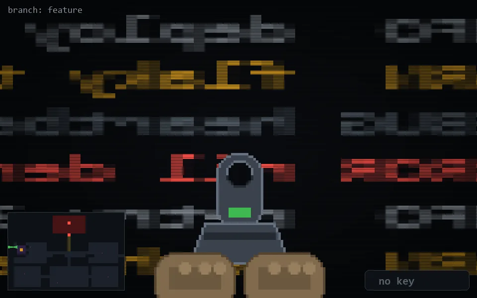

<!-- node:x02y11Wd -->
### `branch: feature` · 📍 (2, 11) · facing W · 🔑 — · ✖ bug deleted (it will be back)

|      |      |      |
|:----:|:----:|:----:|
|      | ⛔️ |      |
| [⬅️](x02y11Sd.md) | [💥](x02y11Wd.md) | [➡️](x02y11Nd.md) |
|      | [⬇️](x03y11Ww3.md) |      |

[⌂ index](../README.md)
