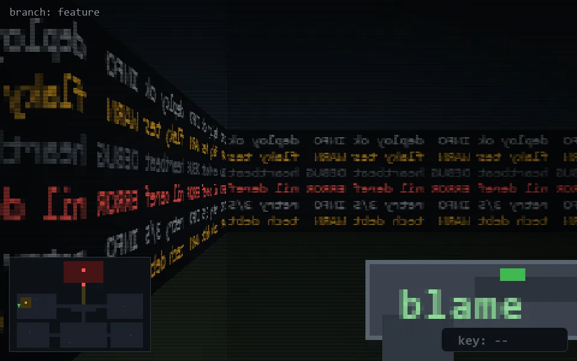

<!-- node:x02y13N -->
### `branch: feature` · 📍 (2, 13) · facing N · 🔑 —

|      |      |      |
|:----:|:----:|:----:|
|      | [⬆️](x02y12N.md) |      |
| [⬅️](x02y13W.md) | [💥](x02y13N.md) | [➡️](x02y13E.md) |
|      | [⬇️](x02y14N.md) |      |

[⌂ index](../README.md)
