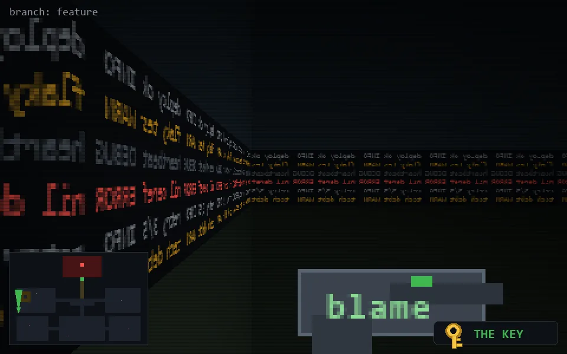

<!-- node:x02y16Nk -->
### `branch: feature` · 📍 (2, 16) · facing N · 🔑 THE KEY

|      |      |      |
|:----:|:----:|:----:|
|      | [⬆️](x02y15Nk.md) |      |
| [⬅️](x02y16Wk.md) | [💥](x02y16Nkd.md) | [➡️](x02y16Ek.md) |
|      | ⛔️ |      |

[⌂ index](../README.md)
