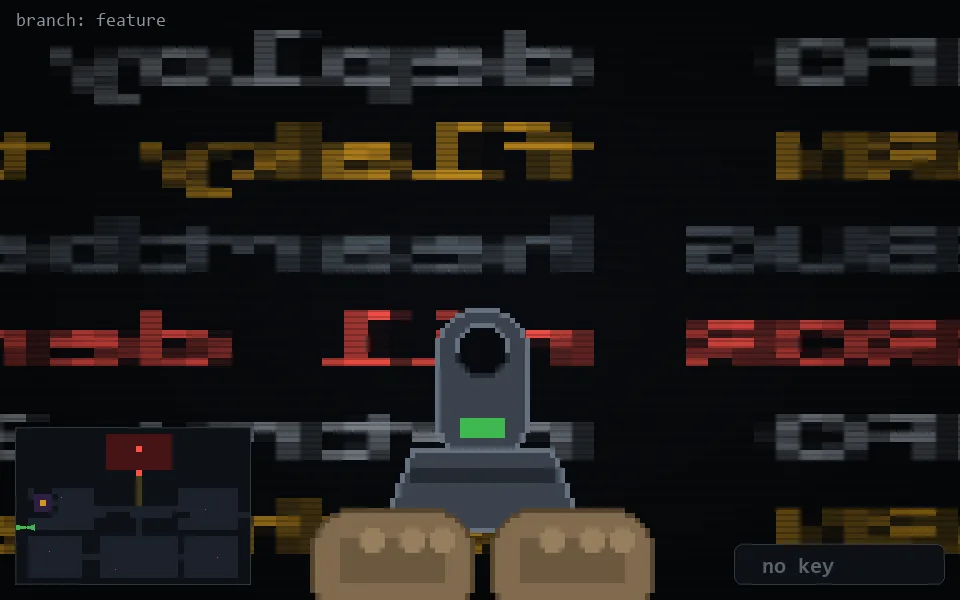

<!-- node:x02y16Wd -->
### `branch: feature` · 📍 (2, 16) · facing W · 🔑 — · ✖ bug deleted (it will be back)

|      |      |      |
|:----:|:----:|:----:|
|      | ⛔️ |      |
| [⬅️](x02y16Sd.md) | [💥](x02y16Wd.md) | [➡️](x02y16Nd.md) |
|      | [⬇️](x03y16Wd.md) |      |

[⌂ index](../README.md)
