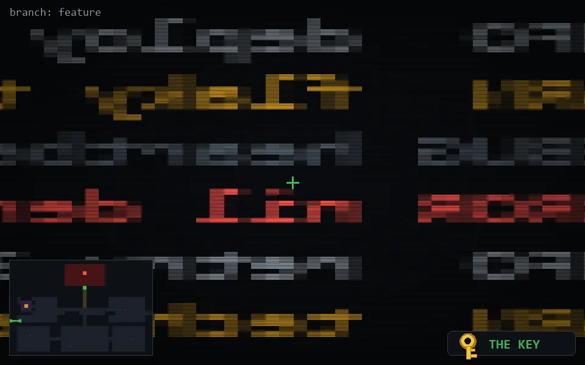

<!-- node:x02y16Wk -->
### `branch: feature` · 📍 (2, 16) · facing W · 🔑 THE KEY

|      |      |      |
|:----:|:----:|:----:|
|      | ⛔️ |      |
| [⬅️](x02y16Sk.md) | [💥](x02y16Wkd.md) | [➡️](x02y16Nk.md) |
|      | [⬇️](x03y16Wk.md) |      |

[⌂ index](../README.md)
