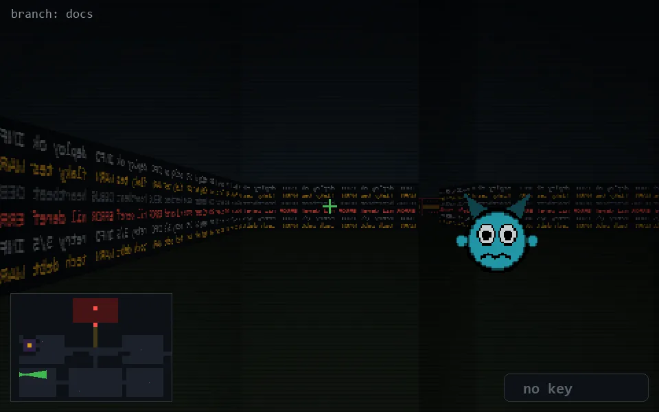

<!-- node:x02y19E -->
### `branch: docs` · 📍 (2, 19) · facing E · 🔑 —

|      |      |      |
|:----:|:----:|:----:|
|      | [⬆️](x03y19E.md) |      |
| [⬅️](x02y19N.md) | [💥](x02y19Ed.md) | [➡️](x02y19S.md) |
|      | ⛔️ |      |

[⌂ index](../README.md)
