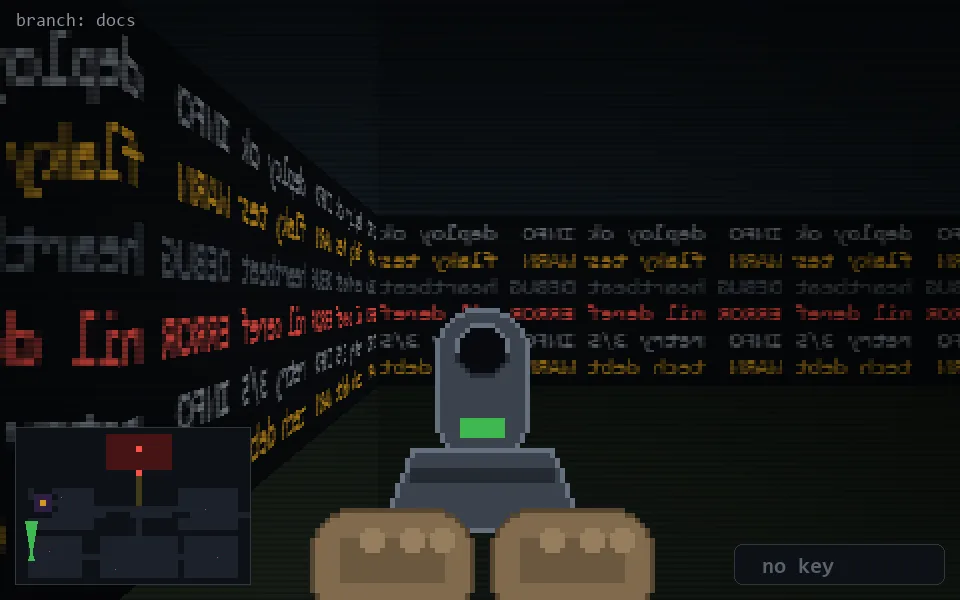

<!-- node:x02y21Nd -->
### `branch: docs` · 📍 (2, 21) · facing N · 🔑 — · ✖ bug deleted (it will be back)

|      |      |      |
|:----:|:----:|:----:|
|      | [⬆️](x02y20Nd.md) |      |
| [⬅️](x02y21Wd.md) | [💥](x02y21Nd.md) | [➡️](x02y21Ed.md) |
|      | [⬇️](x02y22Nd.md) |      |

[⌂ index](../README.md)
