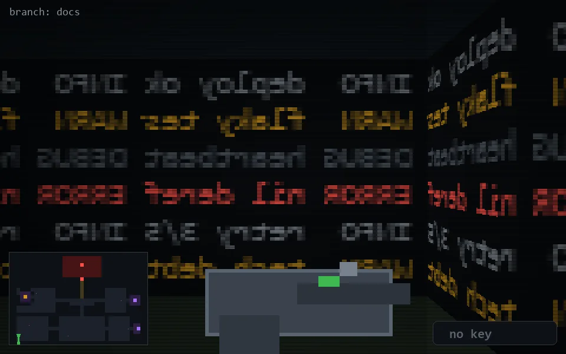

<!-- node:x02y23S -->
### `branch: docs` · 📍 (2, 23) · facing S · 🔑 —

|      |      |      |
|:----:|:----:|:----:|
|      | [⬆️](x02y24S.md) |      |
| [⬅️](x02y23E.md) | [💥](x02y23S.md) | [➡️](x02y23W.md) |
|      | [⬇️](x02y22S.md) |      |

[⌂ index](../README.md)
