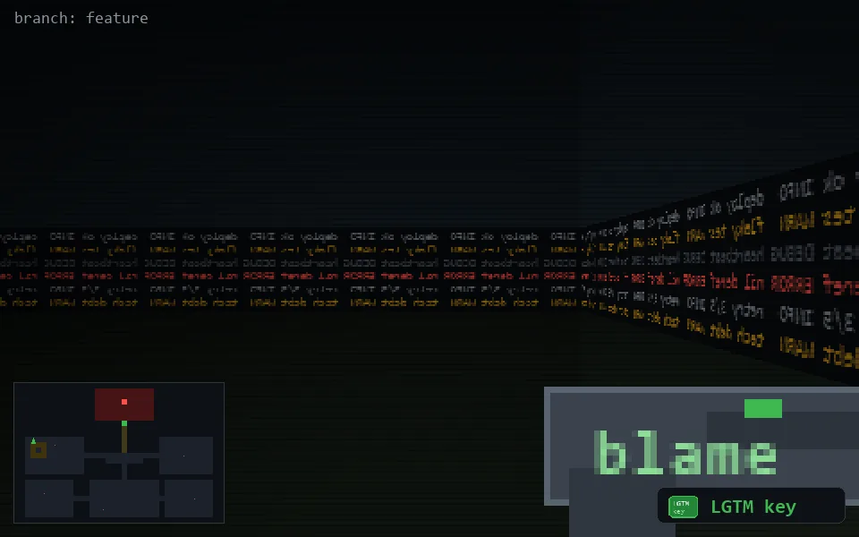

<!-- node:x03y10Sk -->
### `branch: feature` · 📍 (3, 10) · facing S · 🔑 LGTM

|      |      |      |
|:----:|:----:|:----:|
|      | [⬆️](x03y11Sk.md) |      |
| [⬅️](x03y10Ek.md) | [💥](x03y10Sk.md) | [➡️](x03y10Wk.md) |
|      | ⛔️ |      |

[⌂ index](../README.md)
