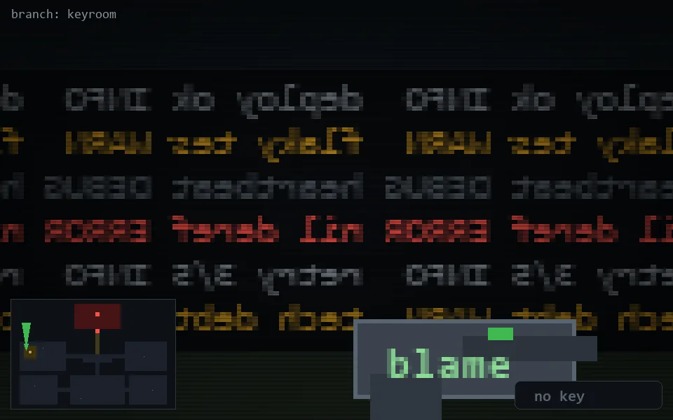

<!-- node:x03y11N -->
### `branch: keyroom` · 📍 (3, 11) · facing N · 🔑 —

|      |      |      |
|:----:|:----:|:----:|
|      | [⬆️](x03y10N.md) |      |
| [⬅️](x03y11W.md) | [💥](x03y11N.md) | [➡️](x03y11E.md) |
|      | [⬇️](x03y12N.md) |      |

[⌂ index](../README.md)
