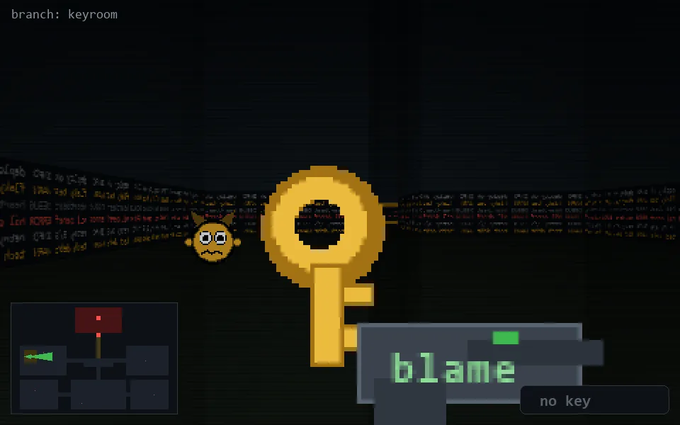

<!-- node:x03y12E -->
### `branch: keyroom` · 📍 (3, 12) · facing E · 🔑 —

|      |      |      |
|:----:|:----:|:----:|
|      | [⬆️](x04y12Ek.md) |      |
| [⬅️](x03y12N.md) | [💥](x03y12E.md) | [➡️](x03y12S.md) |
|      | [⬇️](x02y12E.md) |      |

[⌂ index](../README.md)
