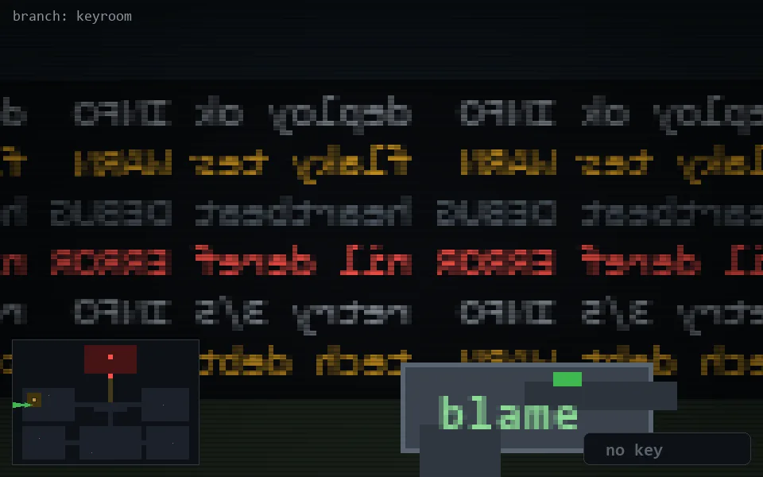

<!-- node:x03y13W -->
### `branch: keyroom` · 📍 (3, 13) · facing W · 🔑 —

|      |      |      |
|:----:|:----:|:----:|
|      | [⬆️](x02y13W.md) |      |
| [⬅️](x03y13S.md) | [💥](x03y13W.md) | [➡️](x03y13N.md) |
|      | [⬇️](x04y13W.md) |      |

[⌂ index](../README.md)
