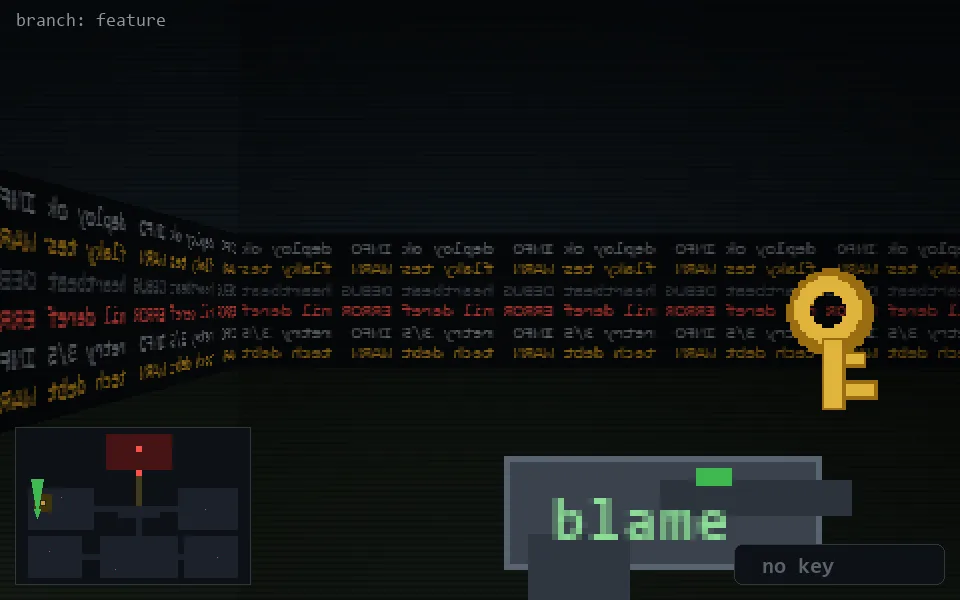

<!-- node:x03y14N -->
### `branch: feature` · 📍 (3, 14) · facing N · 🔑 —

|      |      |      |
|:----:|:----:|:----:|
|      | [⬆️](x03y13N.md) |      |
| [⬅️](x03y14W.md) | [💥](x03y14N.md) | [➡️](x03y14E.md) |
|      | [⬇️](x03y15N.md) |      |

[⌂ index](../README.md)
