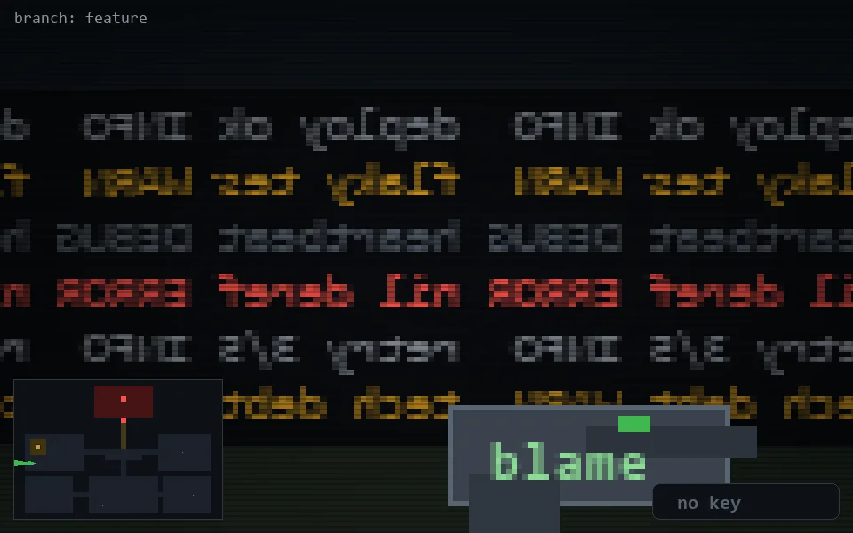

<!-- node:x03y15W -->
### `branch: feature` · 📍 (3, 15) · facing W · 🔑 —

|      |      |      |
|:----:|:----:|:----:|
|      | [⬆️](x02y15W.md) |      |
| [⬅️](x03y15S.md) | [💥](x03y15W.md) | [➡️](x03y15N.md) |
|      | [⬇️](x04y15W.md) |      |

[⌂ index](../README.md)
