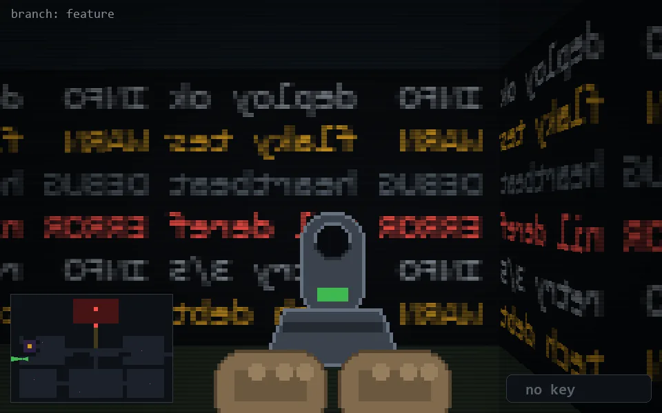

<!-- node:x03y15Wd -->
### `branch: feature` · 📍 (3, 15) · facing W · 🔑 — · ✖ bug deleted (it will be back)

|      |      |      |
|:----:|:----:|:----:|
|      | [⬆️](x02y15Wd.md) |      |
| [⬅️](x03y15Sd.md) | [💥](x03y15Wd.md) | [➡️](x03y15Nd.md) |
|      | [⬇️](x04y15Wd.md) |      |

[⌂ index](../README.md)
