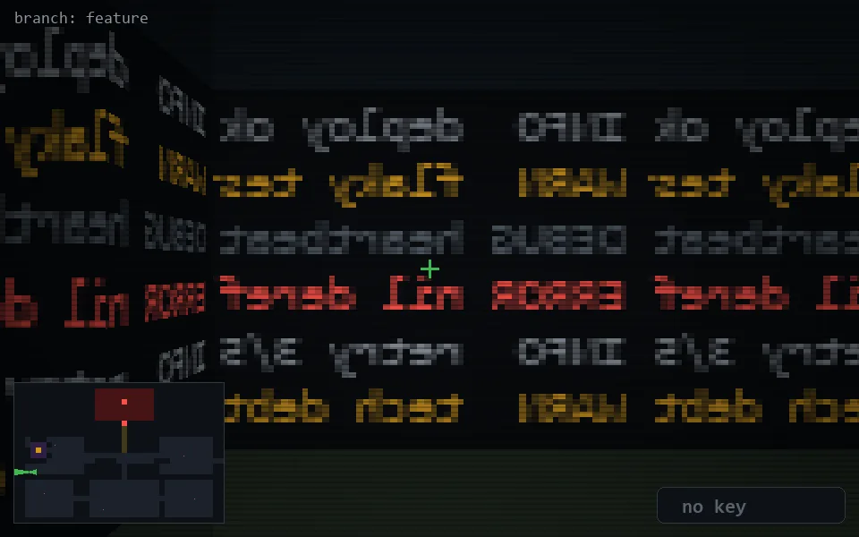

<!-- node:x03y16W -->
### `branch: feature` · 📍 (3, 16) · facing W · 🔑 —

|      |      |      |
|:----:|:----:|:----:|
|      | [⬆️](x02y16W.md) |      |
| [⬅️](x03y16S.md) | [💥](x03y16Wd.md) | [➡️](x03y16N.md) |
|      | [⬇️](x04y16W.md) |      |

[⌂ index](../README.md)
