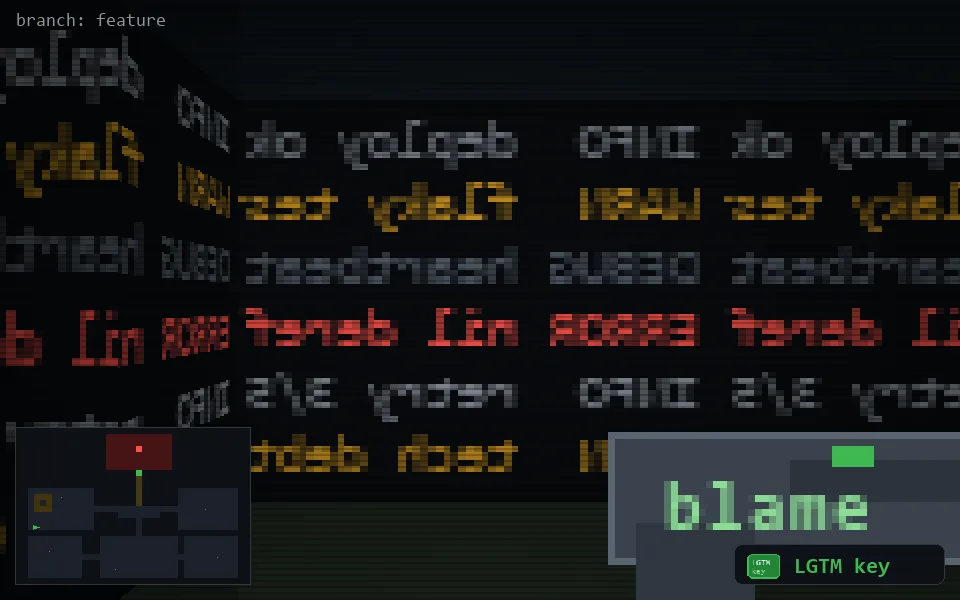

<!-- node:x03y16Wk -->
### `branch: feature` · 📍 (3, 16) · facing W · 🔑 THE KEY

|      |      |      |
|:----:|:----:|:----:|
|      | [⬆️](x02y16Wk.md) |      |
| [⬅️](x03y16Sk.md) | [💥](x03y16Wkd.md) | [➡️](x03y16Nk.md) |
|      | [⬇️](x04y16Wk.md) |      |

[⌂ index](../README.md)
