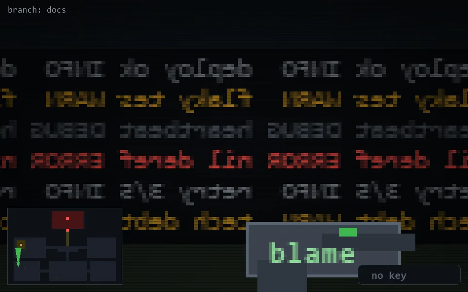

<!-- node:x03y19N -->
### `branch: docs` · 📍 (3, 19) · facing N · 🔑 —

|      |      |      |
|:----:|:----:|:----:|
|      | [⬆️](x03y18N.md) |      |
| [⬅️](x03y19W.md) | [💥](x03y19N.md) | [➡️](x03y19E.md) |
|      | [⬇️](x03y20N.md) |      |

[⌂ index](../README.md)
