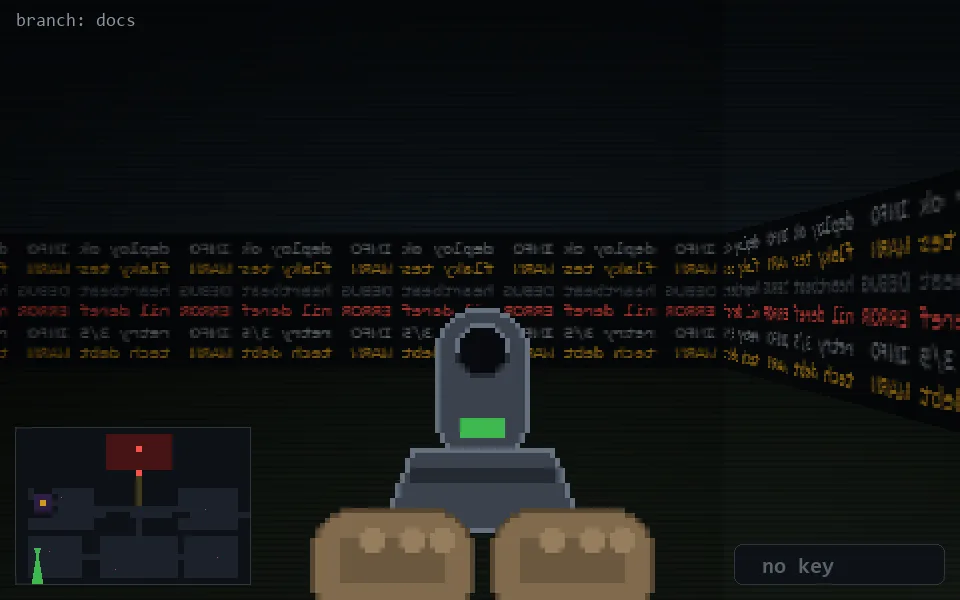

<!-- node:x03y20Sd -->
### `branch: docs` · 📍 (3, 20) · facing S · 🔑 — · ✖ bug deleted (it will be back)

|      |      |      |
|:----:|:----:|:----:|
|      | [⬆️](x03y21Sd.md) |      |
| [⬅️](x03y20Ed.md) | [💥](x03y20Sd.md) | [➡️](x03y20Wd.md) |
|      | [⬇️](x03y19Sd.md) |      |

[⌂ index](../README.md)
