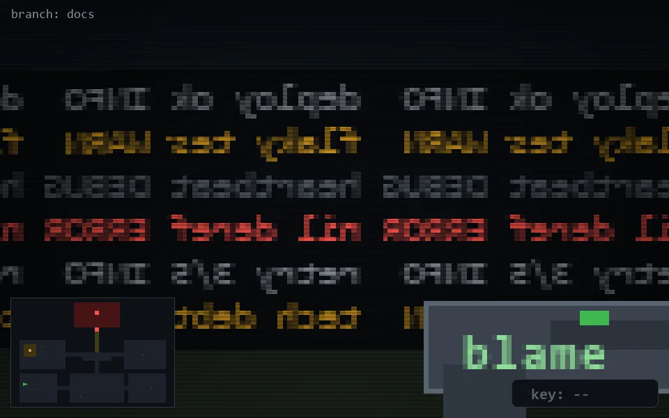

<!-- node:x03y20W -->
### `branch: docs` · 📍 (3, 20) · facing W · 🔑 —

|      |      |      |
|:----:|:----:|:----:|
|      | [⬆️](x02y20W.md) |      |
| [⬅️](x03y20S.md) | [💥](x03y20Wd.md) | [➡️](x03y20N.md) |
|      | [⬇️](x04y20W.md) |      |

[⌂ index](../README.md)
