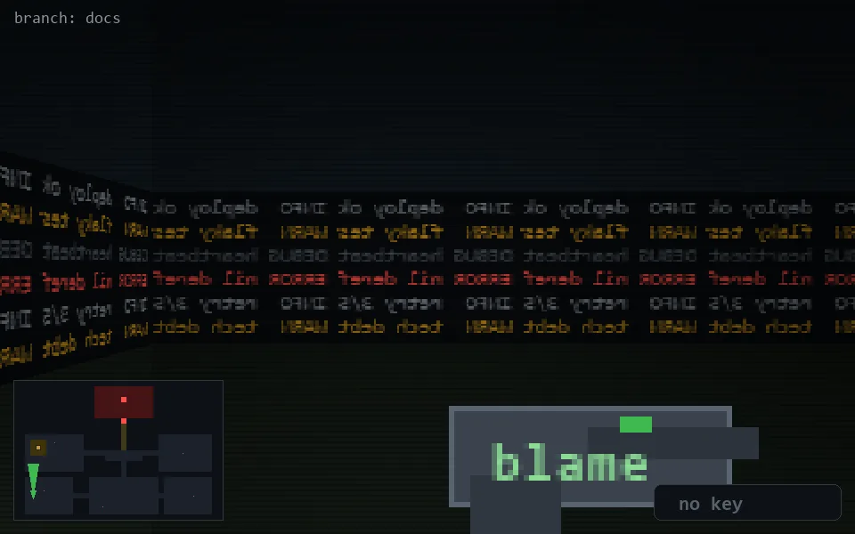

<!-- node:x03y21N -->
### `branch: docs` · 📍 (3, 21) · facing N · 🔑 —

|      |      |      |
|:----:|:----:|:----:|
|      | [⬆️](x03y20N.md) |      |
| [⬅️](x03y21W.md) | [💥](x03y21N.md) | [➡️](x03y21E.md) |
|      | [⬇️](x03y22N.md) |      |

[⌂ index](../README.md)
