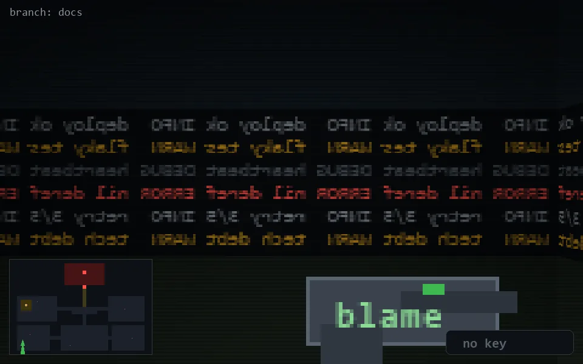

<!-- node:x03y22S -->
### `branch: docs` · 📍 (3, 22) · facing S · 🔑 —

|      |      |      |
|:----:|:----:|:----:|
|      | [⬆️](x03y23S.md) |      |
| [⬅️](x03y22E.md) | [💥](x03y22S.md) | [➡️](x03y22W.md) |
|      | [⬇️](x03y21S.md) |      |

[⌂ index](../README.md)
