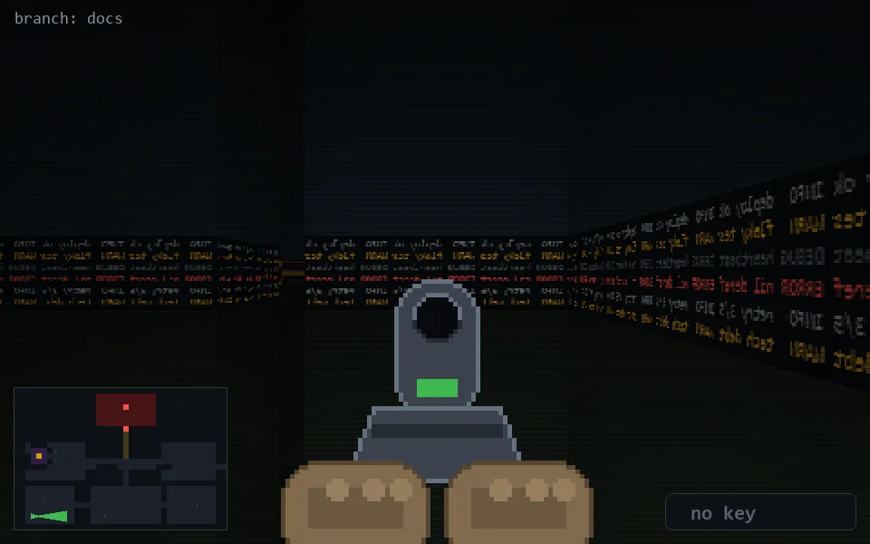

<!-- node:x03y23Ed -->
### `branch: docs` · 📍 (3, 23) · facing E · 🔑 — · ✖ bug deleted (it will be back)

|      |      |      |
|:----:|:----:|:----:|
|      | [⬆️](x04y23Ed.md) |      |
| [⬅️](x03y23Nd.md) | [💥](x03y23Ed.md) | [➡️](x03y23Sd.md) |
|      | [⬇️](x02y23Ed.md) |      |

[⌂ index](../README.md)
