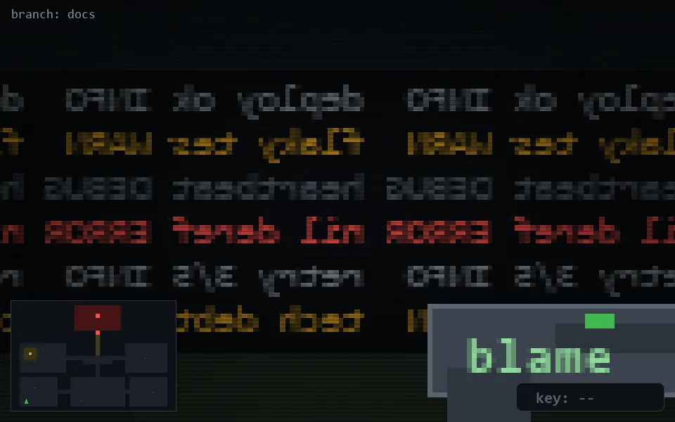

<!-- node:x03y23S -->
### `branch: docs` · 📍 (3, 23) · facing S · 🔑 —

|      |      |      |
|:----:|:----:|:----:|
|      | [⬆️](x03y24S.md) |      |
| [⬅️](x03y23E.md) | [💥](x03y23Sd.md) | [➡️](x03y23W.md) |
|      | [⬇️](x03y22S.md) |      |

[⌂ index](../README.md)
