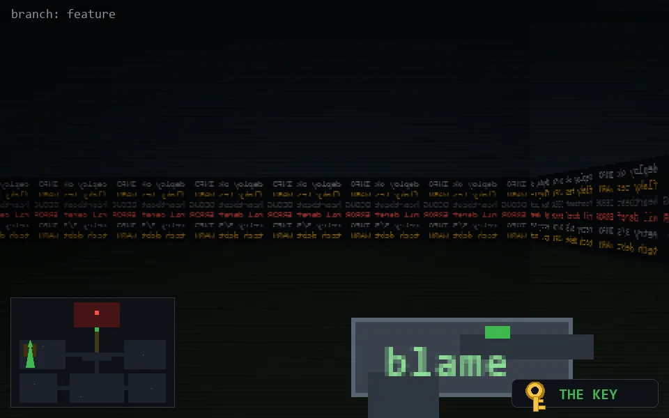

<!-- node:x04y10Sk -->
### `branch: feature` · 📍 (4, 10) · facing S · 🔑 THE KEY

|      |      |      |
|:----:|:----:|:----:|
|      | [⬆️](x04y11Sk.md) |      |
| [⬅️](x04y10Ek.md) | [💥](x04y10Sk.md) | [➡️](x04y10Wk.md) |
|      | ⛔️ |      |

[⌂ index](../README.md)
