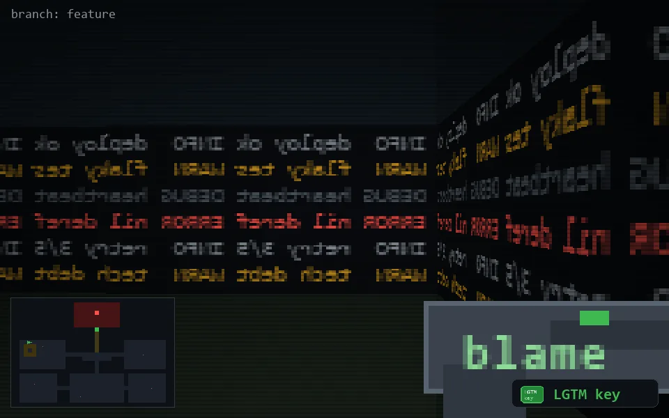

<!-- node:x04y10Wk -->
### `branch: feature` · 📍 (4, 10) · facing W · 🔑 THE KEY

|      |      |      |
|:----:|:----:|:----:|
|      | [⬆️](x03y10Wk.md) |      |
| [⬅️](x04y10Sk.md) | [💥](x04y10Wk.md) | [➡️](x04y10Nk.md) |
|      | [⬇️](x05y10Wk.md) |      |

[⌂ index](../README.md)
