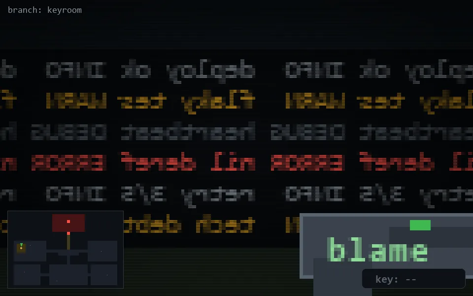

<!-- node:x04y11N -->
### `branch: keyroom` · 📍 (4, 11) · facing N · 🔑 —

|      |      |      |
|:----:|:----:|:----:|
|      | [⬆️](x04y10N.md) |      |
| [⬅️](x04y11W.md) | [💥](x04y11N.md) | [➡️](x04y11E.md) |
|      | [⬇️](x04y12Nk.md) |      |

[⌂ index](../README.md)
