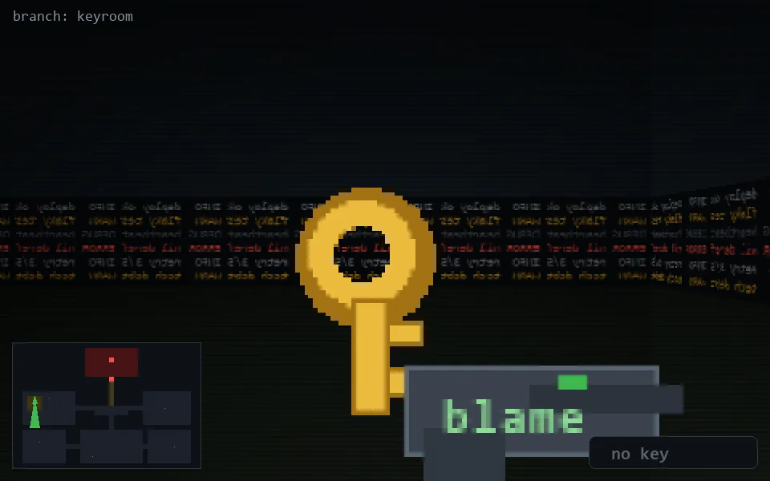

<!-- node:x04y11S -->
### `branch: keyroom` · 📍 (4, 11) · facing S · 🔑 —

|      |      |      |
|:----:|:----:|:----:|
|      | [⬆️](x04y12Sk.md) |      |
| [⬅️](x04y11E.md) | [💥](x04y11S.md) | [➡️](x04y11W.md) |
|      | [⬇️](x04y10S.md) |      |

[⌂ index](../README.md)
