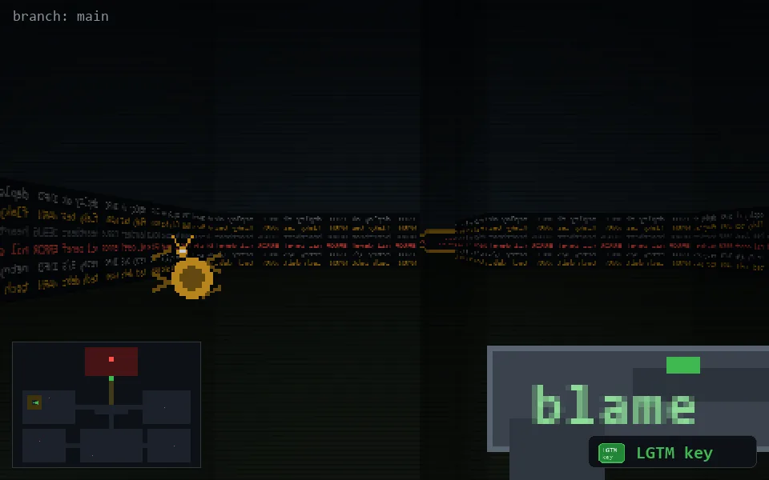

<!-- node:x04y12Ek -->
### `branch: main` · 📍 (4, 12) · facing E · 🔑 LGTM

|      |      |      |
|:----:|:----:|:----:|
|      | [⬆️](x05y12Ek.md) |      |
| [⬅️](x04y12Nk.md) | [💥](x04y12Ek.md) | [➡️](x04y12Sk.md) |
|      | [⬇️](x03y12Ek.md) |      |

[⌂ index](../README.md)
