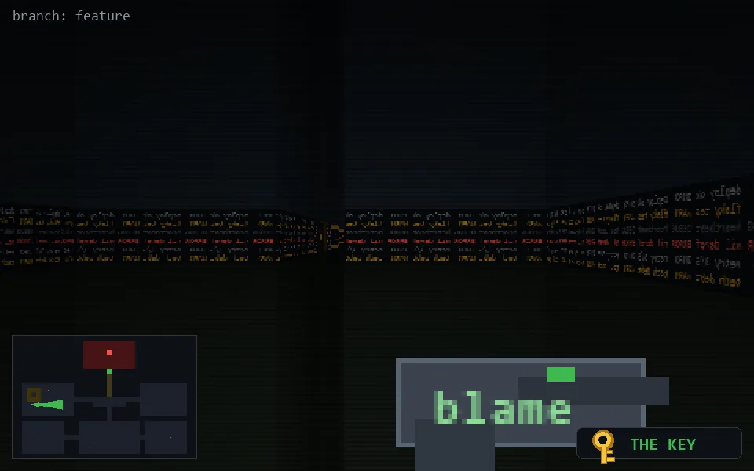

<!-- node:x04y14Ek -->
### `branch: feature` · 📍 (4, 14) · facing E · 🔑 LGTM

|      |      |      |
|:----:|:----:|:----:|
|      | [⬆️](x05y14Ek.md) |      |
| [⬅️](x04y14Nk.md) | [💥](x04y14Ek.md) | [➡️](x04y14Sk.md) |
|      | [⬇️](x03y14Ek.md) |      |

[⌂ index](../README.md)
