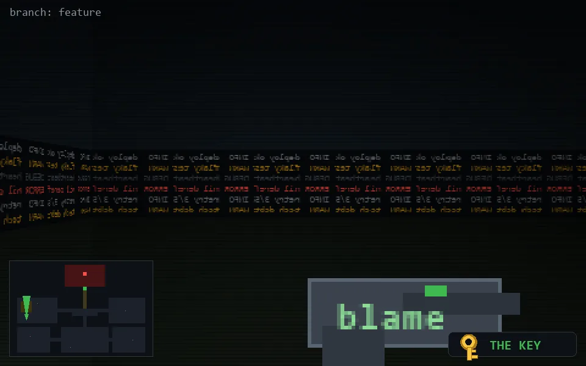

<!-- node:x04y15Nk -->
### `branch: feature` · 📍 (4, 15) · facing N · 🔑 THE KEY

|      |      |      |
|:----:|:----:|:----:|
|      | ⛔️ |      |
| [⬅️](x04y15Wk.md) | [💥](x04y15Nkd.md) | [➡️](x04y15Ek.md) |
|      | [⬇️](x04y16Nk.md) |      |

[⌂ index](../README.md)
