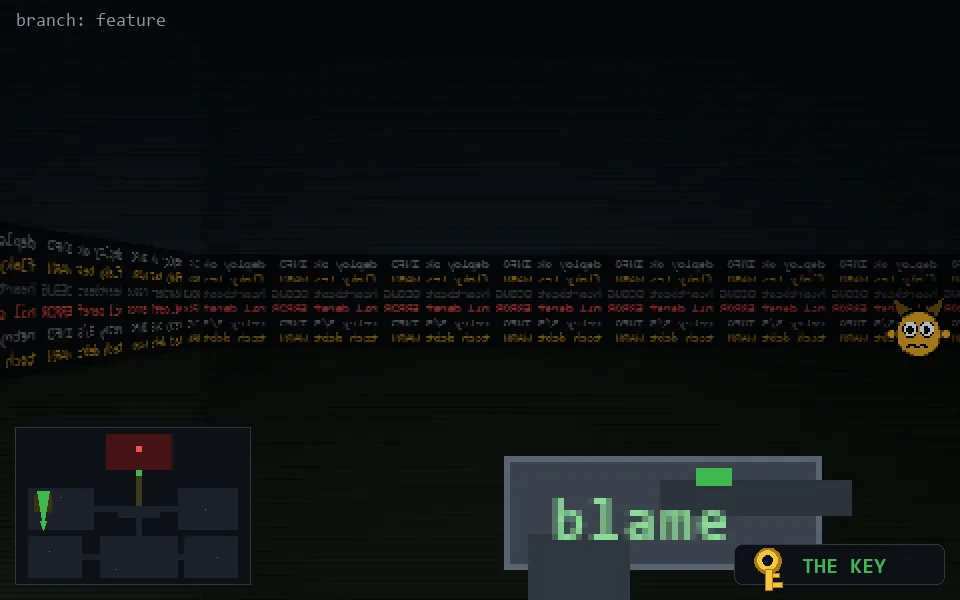

<!-- node:x04y16Nk -->
### `branch: feature` · 📍 (4, 16) · facing N · 🔑 THE KEY

|      |      |      |
|:----:|:----:|:----:|
|      | [⬆️](x04y15Nk.md) |      |
| [⬅️](x04y16Wk.md) | [💥](x04y16Nkd.md) | [➡️](x04y16Ek.md) |
|      | ⛔️ |      |

[⌂ index](../README.md)
