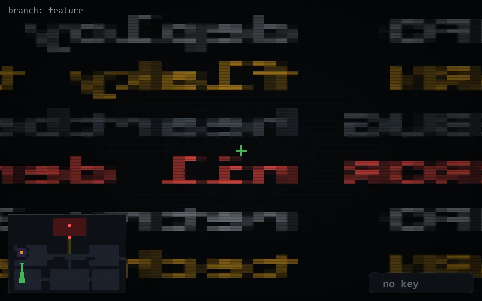

<!-- node:x04y16Sd -->
### `branch: feature` · 📍 (4, 16) · facing S · 🔑 — · ✖ bug deleted (it will be back)

|      |      |      |
|:----:|:----:|:----:|
|      | ⛔️ |      |
| [⬅️](x04y16Ed.md) | [💥](x04y16Sd.md) | [➡️](x04y16Wd.md) |
|      | [⬇️](x04y15Sd.md) |      |

[⌂ index](../README.md)
