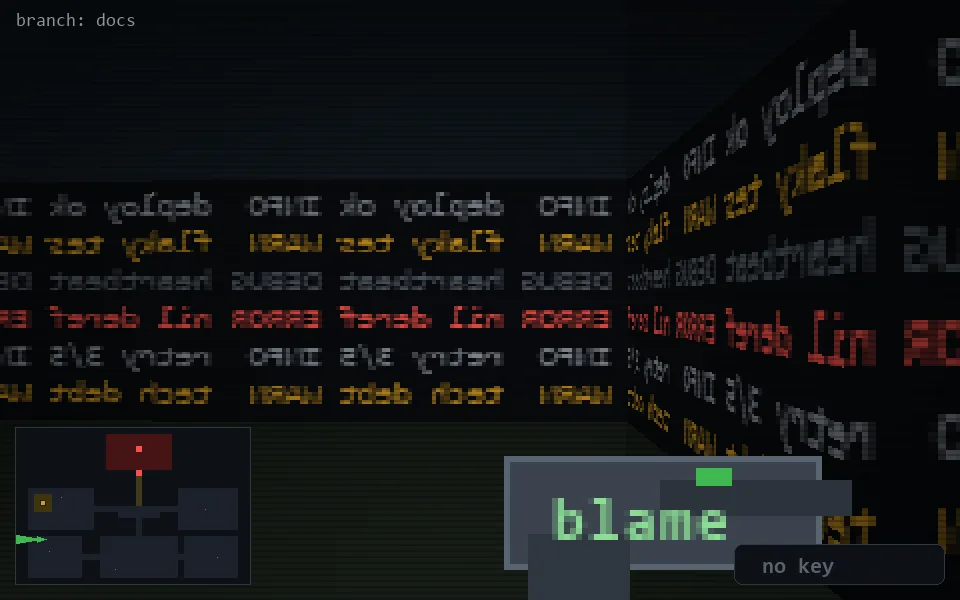

<!-- node:x04y18W -->
### `branch: docs` · 📍 (4, 18) · facing W · 🔑 —

|      |      |      |
|:----:|:----:|:----:|
|      | [⬆️](x03y18W.md) |      |
| [⬅️](x04y18S.md) | [💥](x04y18Wd.md) | [➡️](x04y18N.md) |
|      | [⬇️](x05y18W.md) |      |

[⌂ index](../README.md)
