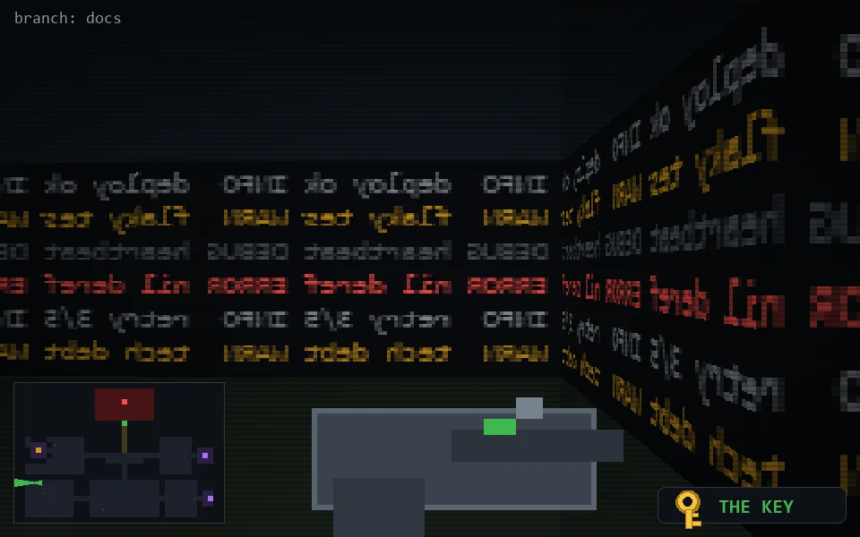

<!-- node:x04y18Wk -->
### `branch: docs` · 📍 (4, 18) · facing W · 🔑 LGTM

|      |      |      |
|:----:|:----:|:----:|
|      | [⬆️](x03y18Wk.md) |      |
| [⬅️](x04y18Sk.md) | [💥](x04y18Wk.md) | [➡️](x04y18Nk.md) |
|      | [⬇️](x05y18Wk.md) |      |

[⌂ index](../README.md)
