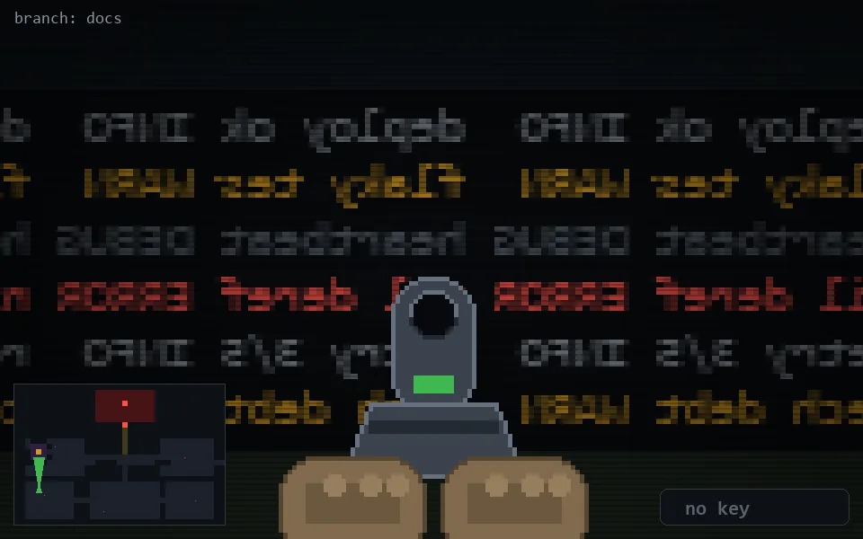

<!-- node:x04y19Nd -->
### `branch: docs` · 📍 (4, 19) · facing N · 🔑 — · ✖ bug deleted (it will be back)

|      |      |      |
|:----:|:----:|:----:|
|      | [⬆️](x04y18Nd.md) |      |
| [⬅️](x04y19Wd.md) | [💥](x04y19Nd.md) | [➡️](x04y19Ed.md) |
|      | [⬇️](x04y20Nd.md) |      |

[⌂ index](../README.md)
