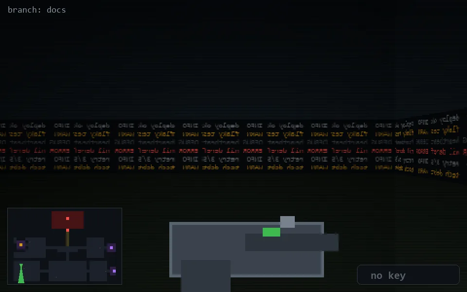

<!-- node:x04y19S -->
### `branch: docs` · 📍 (4, 19) · facing S · 🔑 —

|      |      |      |
|:----:|:----:|:----:|
|      | [⬆️](x04y20S.md) |      |
| [⬅️](x04y19E.md) | [💥](x04y19Sd.md) | [➡️](x04y19W.md) |
|      | [⬇️](x04y18S.md) |      |

[⌂ index](../README.md)
