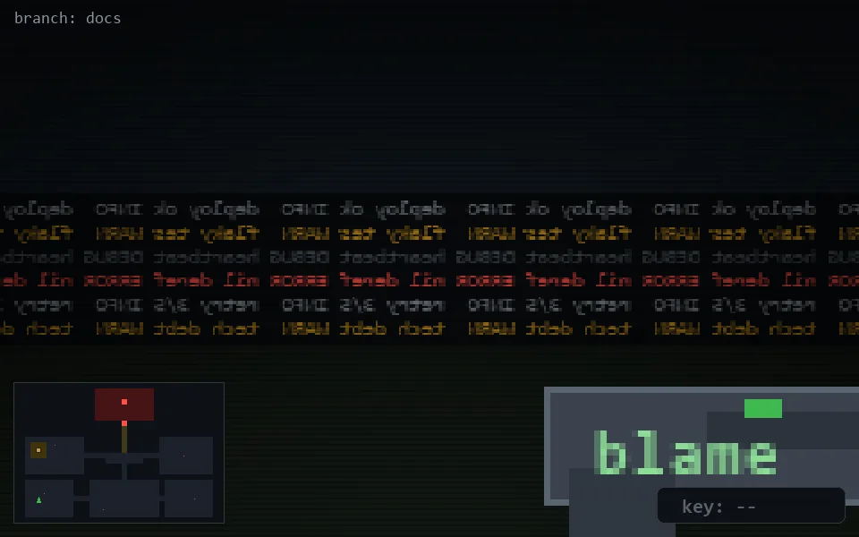

<!-- node:x04y21S -->
### `branch: docs` · 📍 (4, 21) · facing S · 🔑 —

|      |      |      |
|:----:|:----:|:----:|
|      | [⬆️](x04y22S.md) |      |
| [⬅️](x04y21E.md) | [💥](x04y21S.md) | [➡️](x04y21W.md) |
|      | [⬇️](x04y20S.md) |      |

[⌂ index](../README.md)
