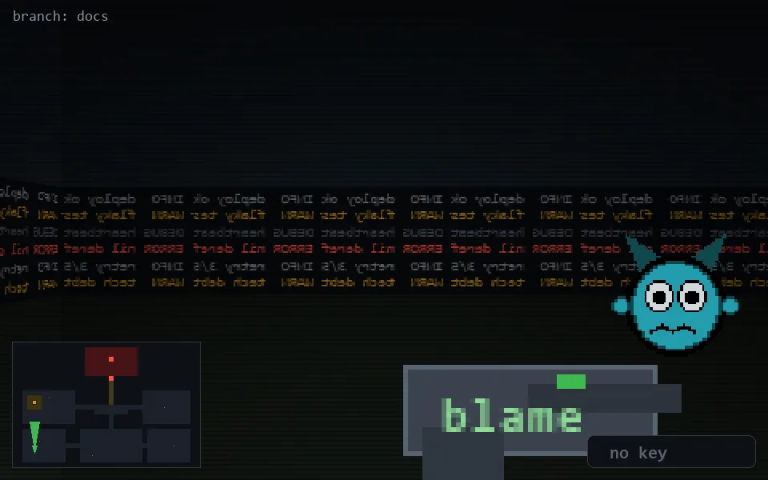

<!-- node:x04y22N -->
### `branch: docs` · 📍 (4, 22) · facing N · 🔑 —

|      |      |      |
|:----:|:----:|:----:|
|      | [⬆️](x04y21N.md) |      |
| [⬅️](x04y22W.md) | [💥](x04y22Nd.md) | [➡️](x04y22E.md) |
|      | [⬇️](x04y23N.md) |      |

[⌂ index](../README.md)
