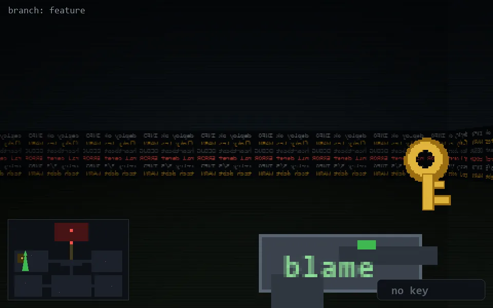

<!-- node:x05y10S -->
### `branch: feature` · 📍 (5, 10) · facing S · 🔑 —

|      |      |      |
|:----:|:----:|:----:|
|      | [⬆️](x05y11S.md) |      |
| [⬅️](x05y10E.md) | [💥](x05y10S.md) | [➡️](x05y10W.md) |
|      | ⛔️ |      |

[⌂ index](../README.md)
