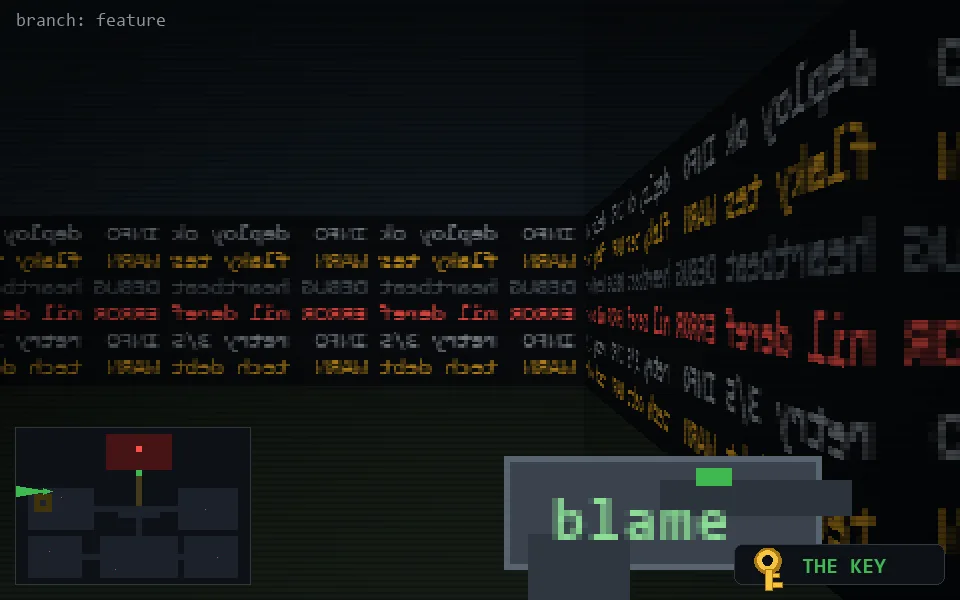

<!-- node:x05y10Wk -->
### `branch: feature` · 📍 (5, 10) · facing W · 🔑 LGTM

|      |      |      |
|:----:|:----:|:----:|
|      | [⬆️](x04y10Wk.md) |      |
| [⬅️](x05y10Sk.md) | [💥](x05y10Wk.md) | [➡️](x05y10Nk.md) |
|      | [⬇️](x06y10Wk.md) |      |

[⌂ index](../README.md)
