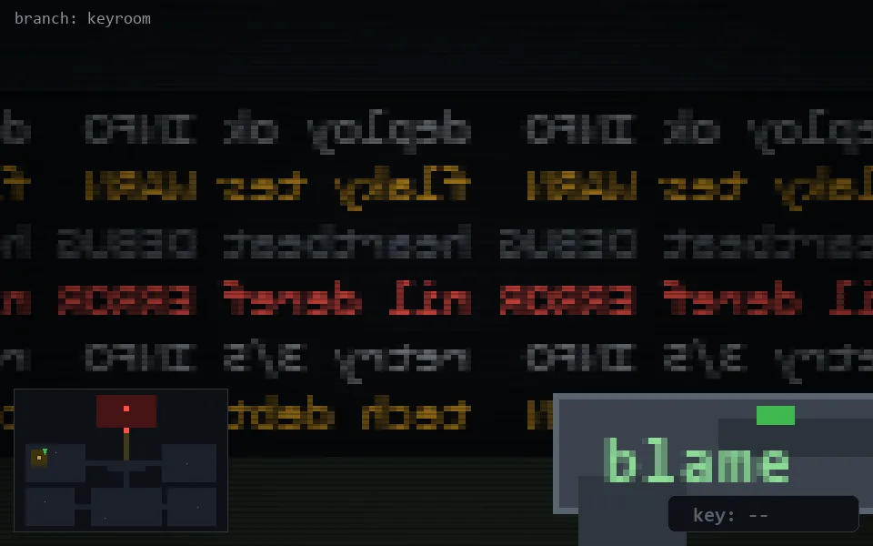

<!-- node:x05y11N -->
### `branch: keyroom` · 📍 (5, 11) · facing N · 🔑 —

|      |      |      |
|:----:|:----:|:----:|
|      | [⬆️](x05y10N.md) |      |
| [⬅️](x05y11W.md) | [💥](x05y11N.md) | [➡️](x05y11E.md) |
|      | [⬇️](x05y12N.md) |      |

[⌂ index](../README.md)
