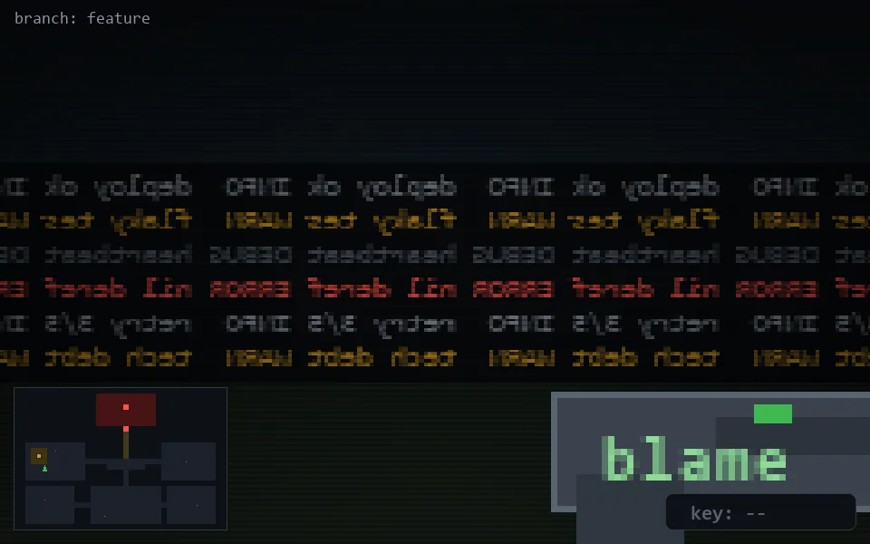

<!-- node:x05y14S -->
### `branch: feature` · 📍 (5, 14) · facing S · 🔑 —

|      |      |      |
|:----:|:----:|:----:|
|      | [⬆️](x05y15S.md) |      |
| [⬅️](x05y14E.md) | [💥](x05y14S.md) | [➡️](x05y14W.md) |
|      | [⬇️](x05y13S.md) |      |

[⌂ index](../README.md)
