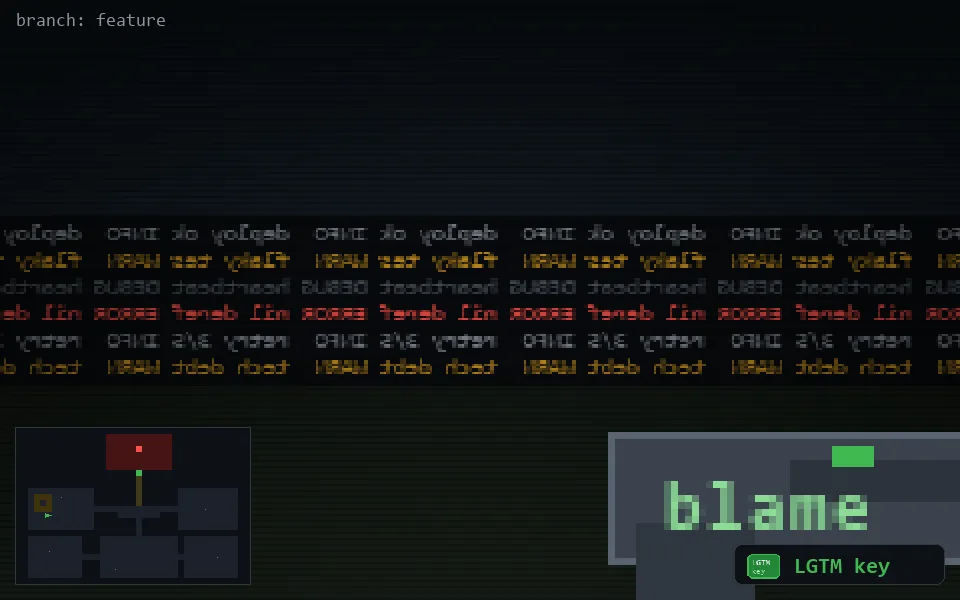

<!-- node:x05y14Wk -->
### `branch: feature` · 📍 (5, 14) · facing W · 🔑 LGTM

|      |      |      |
|:----:|:----:|:----:|
|      | [⬆️](x04y14Wk.md) |      |
| [⬅️](x05y14Sk.md) | [💥](x05y14Wk.md) | [➡️](x05y14Nk.md) |
|      | [⬇️](x06y14Wk.md) |      |

[⌂ index](../README.md)
