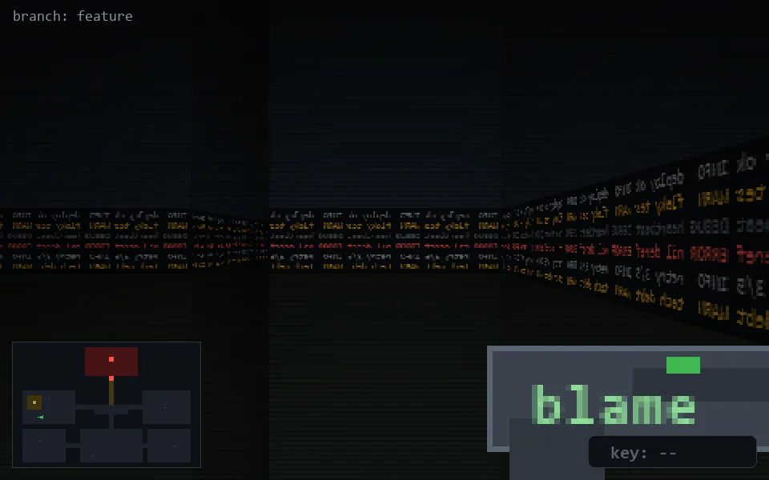

<!-- node:x05y15E -->
### `branch: feature` · 📍 (5, 15) · facing E · 🔑 —

|      |      |      |
|:----:|:----:|:----:|
|      | [⬆️](x06y15E.md) |      |
| [⬅️](x05y15N.md) | [💥](x05y15Ed.md) | [➡️](x05y15S.md) |
|      | [⬇️](x04y15E.md) |      |

[⌂ index](../README.md)
