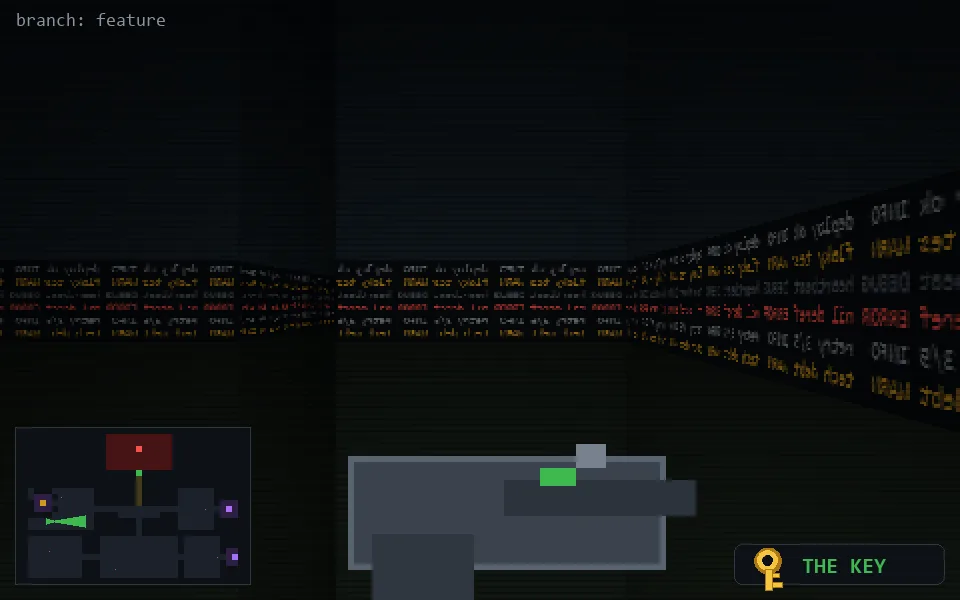

<!-- node:x05y15Ek -->
### `branch: feature` · 📍 (5, 15) · facing E · 🔑 LGTM

|      |      |      |
|:----:|:----:|:----:|
|      | [⬆️](x06y15Ek.md) |      |
| [⬅️](x05y15Nk.md) | [💥](x05y15Ek.md) | [➡️](x05y15Sk.md) |
|      | [⬇️](x04y15Ek.md) |      |

[⌂ index](../README.md)
