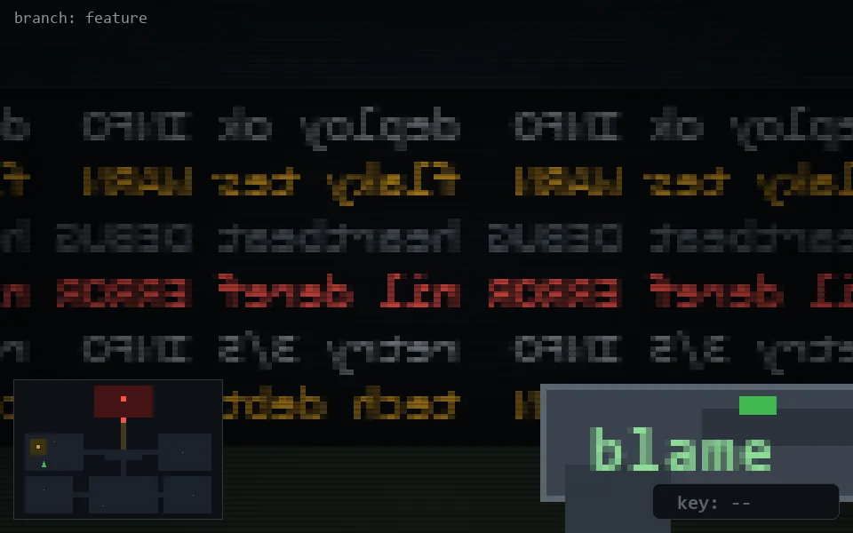

<!-- node:x05y15S -->
### `branch: feature` · 📍 (5, 15) · facing S · 🔑 —

|      |      |      |
|:----:|:----:|:----:|
|      | [⬆️](x05y16S.md) |      |
| [⬅️](x05y15E.md) | [💥](x05y15S.md) | [➡️](x05y15W.md) |
|      | ⛔️ |      |

[⌂ index](../README.md)
